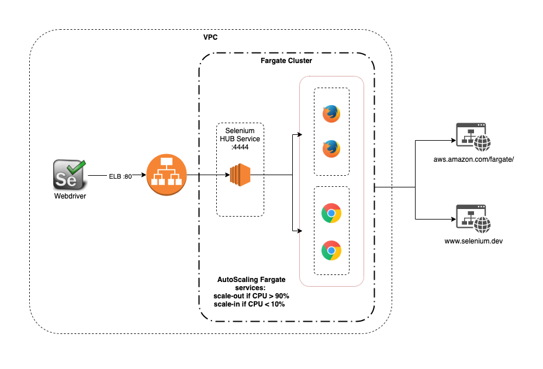

TerraformFargateSeleniumGrid
============================

This project provides `terraform` code to deploy an autoscaling `selenium grid` running on `AWS Fargate` platform inside AWS VPC.



## Prereqs
----------
#### Tools
  * aws cli installed
  * aws cli credentials configured
  * terraform cli >= 1.0

#### Existing resources
  * AWS VPC    
  * S3 bucket (for storing the terraform state) 

#### Update `terraform/terraform.tfvars`
```
state_s3_bucket = ""
app_name = ""
vpc_id = ""
subnet_ids_nodes = ["",""]
subnet_ids_hub = ["",""]
subnet_ids_elb = ["",""]
```

## Deploy
---------

Open a terminal, enter the root of this repo and execute:
```shell
# initialise  
terraform -chdir=terraform init -backend-config="key=selenium_grid_state"

# see what resources are going to be added/removed/changed, before taking action
terraform -chdir=terraform plan

# deploy the resources
terraform -chdir=terraform apply -refresh=true 
```

Note the outputs
```
Outputs:

selenium_grid_console_url = "http://internal-selenium-1111111111.us-east-1.elb.amazonaws.com/grid/console"
selenium_grid_test_url = "http://internal-selenium-blog-1111111111.us-east-1.elb.amazonaws.com/wd/hub"
```

## Test
------------

There is a simple test in `smashtest\main.smash`

`selenium_grid_test_url` is one of the outputs from the `terraform apply` command in the Deploy section

To run the test, open a terminal, change to the `smashtest\` directory and run: 

```shell
npm install smashtest

npx smashtest --test-server=[selenium_grid_test_url] --max-parallel=6
```

## Clean up
------------

To remove the deployed resources :
```shell
terraform -chdir=terraform destroy
```
